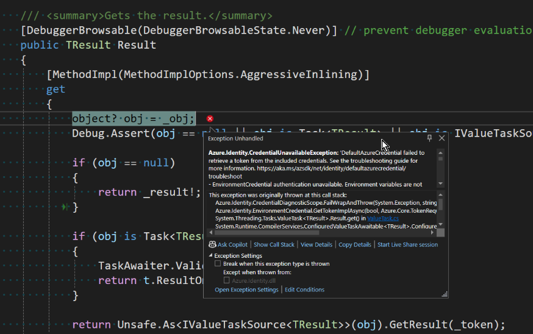

# Blazor Puzzle #66

## The Key Vault is Locked!

YouTube Video: https://youtu.be/fktJzff-ul8

Blazor Puzzle Home Page: https://blazorpuzzle.com

### The Challenge:

We have a Blazor Web App in which we have moved some configuration values from appsettings.json into an Azure Key Vault.

We followed the instructions, but we can't get it working in Visual Studio.

Here's the error we get in *ValueTask.cs*:

Why doesn't it work?

