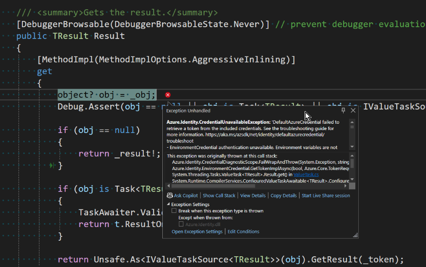

# Blazor Puzzle #66

## The Key Vault is Locked!

YouTube Video: https://youtu.be/fktJzff-ul8

Blazor Puzzle Home Page: https://blazorpuzzle.com

### The Challenge:

We have a Blazor Web App in which we have moved some configuration values from appsettings.json into an Azure Key Vault.

We followed the instructions, but we can't get it working in Visual Studio.

Here's the error we get in *ValueTask.cs*:



Why doesn't it work?

### The Solution:

The solution is to make sure you are logged in to Azure somehow.

The easiest way to do this is with the Azure CLI.

Install the Azure CLI from https://learn.microsoft.com/en-us/cli/azure/install-azure-cli-windows?pivots=winget

Once installed, open a command line prompt and log in:

```
Az Login
```

You'll need to use your browser to complete the login.

Once logged in, go back to Visual Studio and everything should work as expected!

Boom!
